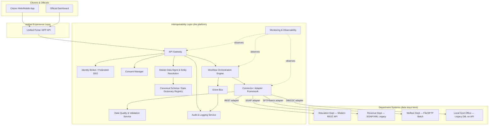
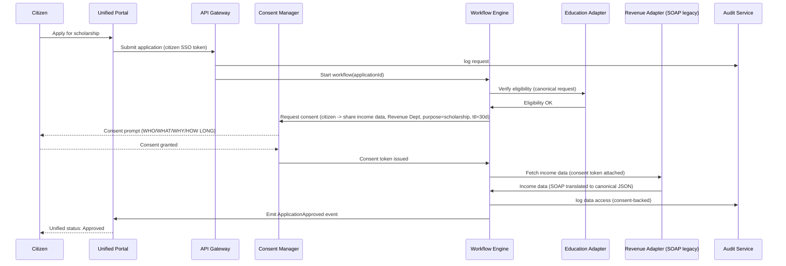
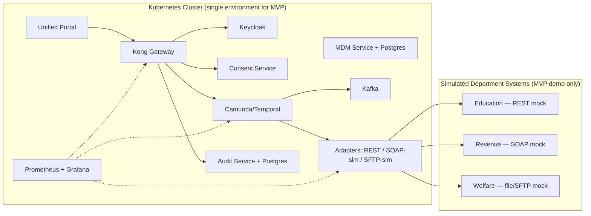

# High-Level Design — Government Interoperability Platform (SIH26129)

Built on the recommended direction from [`ANALYSIS.md`](./ANALYSIS.md): **Option D — a hybrid, federated interoperability layer** that brokers identity, consent, data mapping, and workflow across departments, without owning departments' authoritative data.

---

## 1. Architecture Overview



**Key principle:** departments never lose ownership of their data. The platform stores only identity mappings, consent records, canonical metadata, workflow state, and audit logs — never a copy of the authoritative department record.

---

## 2. Component Breakdown

### 2.1 Unified Experience Layer
Single citizen-facing portal (web + mobile) and a single official-facing dashboard. Backed by a Backend-for-Frontend (BFF) that talks only to the API Gateway — hides all departmental complexity from end users.

### 2.2 API Gateway
Single entry point for every request into the platform. Responsible for: rate limiting, request routing, TLS termination, request/response logging hook into Audit, and enforcing that every call carries a valid identity + consent token before reaching a connector.

### 2.3 Identity Broker / Federated SSO
Issues one citizen session usable across all onboarded department flows (OIDC/SAML federation). Also handles service-to-service identity for departments/systems calling into the platform (mTLS or signed JWT per department). Does **not** replace department-internal auth — it federates on top of it.

### 2.4 Consent Manager
Implements the WHO / WHAT / WHY / FOR HOW LONG / UNDER WHAT AUTHORIZATION model from the problem statement. Issues short-lived, purpose-bound, revocable consent tokens. Modeled after India's DEPA/Account Aggregator consent-artifact pattern. Every data access through the gateway must present a valid consent token (except statutorily-authorized official access, which is separately logged).

### 2.5 Master Data Management (MDM) & Entity Resolution
Maintains a **mapping table**, not a copy of citizen data: `platform_entity_id ↔ {dept_A: citizen_id=C123, dept_B: beneficiary_id=B9382, dept_C: customer_id=78192}`. Performs deterministic matching (shared ID like Aadhaar where available) and probabilistic matching (name + DOB + address fuzzy match with confidence scoring) where it isn't. Confidence below threshold routes to manual reconciliation by an official.

### 2.6 Canonical Schema / Data Dictionary Registry
Central registry of canonical entity definitions (Citizen, Business, Application, Service, Location) and field-level mappings per department (`full_name → citizen_name`, `dob → date_of_birth`). Versioned, so department schema changes don't silently break consumers. This is the artifact that solves the "different data formats" problem structurally, not ad hoc per integration.

### 2.7 Workflow Orchestration Engine
Coordinates multi-department processes as explicit state machines (e.g., Scholarship Application: Submit → Education Verify → Revenue Income-Check → Welfare Approve → Complete). Tracks a single `application_id` across all departments involved, exposing one unified status to the citizen regardless of how many departments/steps are internally involved. Handles retries, timeouts, and partial-failure paths (Section 2.9).

### 2.8 Event Bus
Publishes domain events (`ApplicationSubmitted`, `DocumentVerified`, `ApplicationApproved`, `ConsentGranted`, `ConsentRevoked`) that departments and the workflow engine subscribe to. Decouples departments from each other — a department reacts to an event without knowing which other department produced it.

### 2.9 Connector / Adapter Framework
One adapter per department system, translating its native protocol (REST, SOAP/XML, SFTP batch file, direct DB/CDC read) into the platform's canonical contract. This is the **only** place that contains department-specific integration logic — isolates legacy quirks from the rest of the platform, and is what lets a department modernize its backend later without breaking the platform contract (see ANALYSIS.md §14–15).

### 2.10 Data Quality & Validation Service
Runs at the adapter boundary: schema validation, required-field checks, format checks, duplicate detection. Bad records are flagged/quarantined with the source department notified, not silently forwarded downstream.

### 2.11 Audit & Logging Service
Immutable, queryable log of every access: who, what data, when, which department, under what consent/authorization, and outcome. Answers the auditor's exact question set from the problem statement.

### 2.12 Monitoring & Observability
Dashboards for API health, per-adapter latency/error rate, event-processing lag, data-quality flag rates, and SLA compliance per workflow type. This is what lets officials/operators see integration health, not just individual transaction status.

---

## 3. Example Data Flow — Cross-Department Scholarship Application



Note the citizen never re-enters income data — it's fetched, consent-gated, directly from Revenue's system via its adapter.

---

## 4. Failure Handling / Graceful Degradation

```
Revenue system down mid-workflow
        │
        ▼
Adapter detects timeout/failure
        │
        ▼
Workflow engine marks that step "pending — dependency unavailable"
        │
        ├── Retries with backoff (bounded attempts)
        ├── Other independent workflow branches continue (e.g., Education verification proceeds)
        ├── Citizen sees real status: "Waiting on Revenue Department — no action needed"
        └── If retries exhausted: queued for async completion + official notified for manual follow-up
```

The workflow never hard-fails the whole application because one department is briefly unavailable — this is the direct architectural answer to ANALYSIS.md §12.

---

## 5. Technology Stack

Two tiers below: **MVP** is what the hackathon build actually runs (optimized for build speed and demo-ability, same architectural shape as the HLD). **Production** is what a real state rollout would harden into. The component boundaries don't change between tiers — only the concrete technology backing each box does.

| Layer | MVP (hackathon build) | Production (state rollout) | Why the swap |
|---|---|---|---|
| Unified Portal (citizen/official) | Next.js + TypeScript + Tailwind | Next.js + TypeScript + Tailwind | Same at both tiers — no reason to change |
| BFF / API Gateway | Kong Gateway (OSS, single node) | Kong Gateway (clustered) or Apigee | MVP needs just routing/rate-limit/auth-plugin demo; production needs HA + enterprise support option |
| Identity Broker / SSO | Keycloak (single node, docker-compose) | Keycloak (clustered) or state-run federated IDP | Same tech, just HA'd — federation logic doesn't change |
| Consent Manager | Custom NestJS service, in-memory/Postgres-backed consent store | Same custom service, hardened: hashed audit chain, key rotation, formal DEPA/Account Aggregator artifact compliance review | Consent logic is bespoke either way; production adds compliance hardening, not new tech |
| Workflow Orchestration | Temporal (single-node dev server) | Temporal Cloud or self-hosted Temporal cluster, or Camunda 8 if BPMN visual modeling is mandated by department process owners | Temporal's local dev mode is fast to stand up; production needs durability/HA |
| Event Bus | NATS (lightweight, one binary) | Apache Kafka (durable, replayable, multi-consumer at state scale) | NATS is fast to demo; Kafka's replay/retention matters once many departments depend on the same event stream |
| Master Data Management / Entity Resolution | FastAPI + PostgreSQL, fuzzy match via `rapidfuzz` in-process | FastAPI/Java service + PostgreSQL + Elasticsearch for fuzzy matching at scale, human-review queue UI | Rapidfuzz is enough for a few hundred demo records; state-scale fuzzy matching needs a real search index |
| Canonical Schema Registry | JSON Schema files versioned in this Git repo | Dedicated schema registry service (e.g., Confluent Schema Registry if on Kafka) with governance workflow for change approval | Git is sufficient for a small MVP schema set; production needs enforced compatibility checks and a formal change-approval workflow |
| Connector / Adapter Framework | Custom lightweight Node.js/Python adapters per protocol (REST, SOAP mock, SFTP mock) | Apache Camel (Java) or hardened custom adapters, one per real department system, with contract tests | Camel's setup overhead isn't worth it for 2-3 simulated department systems; it earns its place once adapters number in the dozens against real legacy systems |
| Data Quality Service | Inline validation rules in each adapter (simple rule checks) | Great Expectations or equivalent rule engine, with per-department data-quality dashboards | Inline checks prove the pattern; a real deployment needs a shared, auditable rule framework departments can inspect |
| Audit & Logging | PostgreSQL append-only table, simple query view | PostgreSQL (or hash-chained immutable log) + OpenSearch for fast full-text audit search | Append-only Postgres is enough to prove the audit trail concept; production needs search at volume |
| Monitoring & Observability | Prometheus + Grafana (docker-compose) | Prometheus + Grafana + OpenTelemetry tracing across all adapters/workflow steps | Same stack; production adds distributed tracing once there are many more moving parts to correlate |
| Databases (platform-owned, metadata only) | PostgreSQL + Redis (single instance each) | PostgreSQL (HA/replicated) + Redis (clustered) | Same tech, HA'd for production load |
| Containerization / Deployment | Docker Compose (single host) | Docker + Kubernetes (multi-node, per-component scaling) | Compose is enough to demo the full system on one laptop/VM; K8s earns its place at real department-count scale |
| CI/CD | GitHub Actions | GitHub Actions (+ staged environments, approval gates) | Same tool; production adds deployment gates |
| Security | OAuth2/OIDC (citizen + service auth via Keycloak), TLS in transit | + mTLS platform↔department, encryption at rest (AES-256), key management service, DPDP Act 2023 compliance audit | MVP proves the auth flow; production must close every gap auditors/regulators would flag |

**Simulated department systems (MVP only):** since real department APIs are unlikely to be reachable during the hackathon, stand up 3 mock services — one REST/JSON, one SOAP/XML, one SFTP/file-drop — so the adapter framework genuinely proves it handles heterogeneous protocols, not just REST.

---

## 6. Deployment View (MVP scope)



For the MVP, real department systems are likely inaccessible — simulate 2–3 department systems (one REST, one SOAP, one file-based) to prove the adapter pattern genuinely handles heterogeneous protocols, per ANALYSIS.md §19.

---

## 7. What This HLD Deliberately Does Not Yet Specify

- Exact database schema / table design (next phase, after this HLD is agreed).
- Exact REST/event payload contracts (defined once the canonical schema for the MVP's chosen entities — Citizen, Application — is drafted).
- Frontend component structure / UI screens.
- Specific department pilot selection (pending ANALYSIS.md §20 open question on data availability).

These are implementation-phase decisions, to be made only after this architecture is reviewed and agreed.
