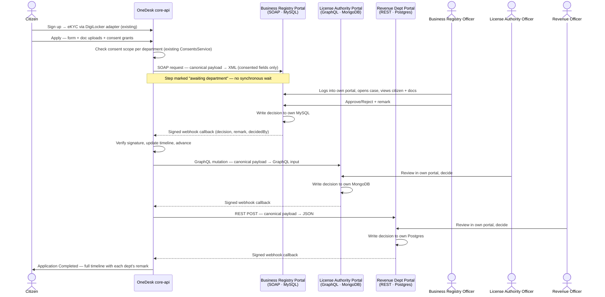

# Live Department Portals — Architecture Plan

**Status:** implemented and verified end-to-end (real SOAP/GraphQL/REST submit calls,
signed webhook callbacks, full three-department auto-advance chain) on branch
`feature/live-department-portals`. See `services/README.md` §"Live department
portals" for boot/login/verify instructions.
Companion to [`HLD.md`](./HLD.md) and [`ANALYSIS.md`](./ANALYSIS.md) — this doc doesn't
replace the interoperability-layer design those chose (Option D, federated, "data stays
with the department"); it's the first real implementation of the part that design always
implied but the current build fakes: **departments that are actually separate systems**,
not five stub endpoints core-api calls and rubber-stamps.

---

## 1. What exists today vs. what this changes

Today, `services/connectors/*-adapter/` are five tiny stateless Express services. Every
one of them does the same thing regardless of protocol: regex-validate the
`applicationId` shape and return VERIFIED/REJECTED after a `setTimeout`. No citizen data
crosses the wire except the ID. No human ever looks at anything. `municipal-adapter` is
the one exception — it has its own Postgres table — but even that just stores a status
row, not a reviewed case.

| | Today | This plan |
|---|---|---|
| Department system | Stub function, one file | Full service: own backend, own DB, own officer UI, own auth |
| What the dept sees | An `applicationId` string | Citizen profile fields (consent-scoped), uploaded documents, application details |
| Who decides | A regex | A logged-in officer, in their own dashboard |
| Decision | Synchronous, instant | Asynchronous — officer decides whenever, dept calls OneDesk back |
| Data mapping | Static seed rows describing fake I/O (`adapter_data_flows`) | Real request/response payloads, actually shaped by protocol |

This directly finishes the sentence `HLD.md` §1 already committed to: *"Department
Systems (data stays here)"*. Right now nothing stays anywhere — there's no department
database with a citizen record in it. This plan gives three departments a real one, each
in a genuinely different shape, and makes core-api talk to them the way it would have to
talk to real, independently-run government IT systems: different protocol, different
schema, different auth domain, no shared database.

---

## 2. Scope: which three departments, which three stacks

Reusing three department names/roles already meaningful in the existing Business License
flow — no need to invent new ones, and it keeps the existing consent/eligibility work
(`ConsentsService`, `EligibilityService`, scopes) directly reusable.

| Department | Protocol (citizen's request says) | DB engine (deliberately different) | New backend port | New frontend port |
|---|---|---|---|---|
| Business Registry | **SOAP/XML** | **MySQL** (relational, "legacy") | `4301` | `5301` |
| License Authority | **GraphQL** | **MongoDB** (document store) | `4302` | `5302` |
| Revenue Department | **REST/JSON** | **PostgreSQL**, own instance/container — *not* core-api's `core_api` database | `4303` | `5303` |

Three different wire protocols, three different database engines, three different
processes, three different logins. Nothing shared except the network and the contract
described in §4.

`Municipal Corporation` (DB adapter) and `Identity Service` (OAuth/eKYC via
`digilocker-adapter`) are **out of scope** — they already have a real-ish shape
(Municipal has its own Postgres + an in-OneDesk officer approval step; Identity is the
existing DigiLocker eKYC flow the citizen goes through at signup, "udhai" in your
message). This plan only replaces the three stub adapters that currently do nothing.

**Open decision for you:** keep reusing the existing `Business License` application
type for this flow, or spin up a new one (e.g. "Trade & Establishment Clearance") so
this doesn't interleave with the consent-gating work already shipped on Business
License today? Recommend the latter — cleaner to build and demo independently,
mergeable back into Business License later once proven.

---

## 3. End-to-end flow



Every step between "OneDesk submits" and "dept calls back" can take real wall-clock
time (an officer might not act for hours) — this is the biggest structural change from
today's code. `WorkflowService.runAutoAdvance` currently `await`s a connector call and
gets an answer in the same request. That model doesn't survive contact with a human in
the loop; §5 covers the replacement.

---

## 4. The canonical contract (what actually crosses the wire)

One shared JSON shape, translated to/from each protocol at the edge — this is the real
version of what `adapter_data_flows` currently fakes.

```jsonc
// OneDesk → Department (outbound, consent-filtered)
{
  "applicationId": "TRD-2026-0042",
  "applicationType": "Trade & Establishment Clearance",
  "citizen": {
    "masterId": "CIT-20003",
    "name": "Kiruthick B",
    // Only fields this department has an Active consent for appear here at all —
    // not sent-then-ignored, actually absent from the payload.
    "dateOfBirth": "2006-05-02",
    "address": "…"
  },
  "documents": [
    { "docId": "doc-8841", "type": "Identity Proof", "url": "https://onedesk/…/signed?exp=…" }
  ],
  "applicationFields": { "businessName": "…", "businessType": "…" },
  "requestedAt": "2026-09-12T10:00:00Z"
}
```

```jsonc
// Department → OneDesk (inbound callback)
{
  "applicationId": "TRD-2026-0042",
  "department": "Business Registry",
  "decision": "APPROVED", // or REJECTED
  "remark": "Business registration verified against MCA records.",
  "decidedBy": "officer.br.demo",
  "decidedAt": "2026-09-12T14:32:00Z"
}
```

- Documents are never pushed as file bytes to every department — a short-lived signed
  URL back to OneDesk's existing `DocumentsService`, so a department can only fetch what
  it was actually handed a link to, and OneDesk's own audit log sees every fetch.
- `applicationFields` is per-application-type, opaque to the transport layer — each
  department's adapter client only needs to know the subset it cares about.
- The callback is deliberately thin. Departments don't push their internal case data
  back — only the decision. Case detail stays in the department's own DB, exactly per
  the HLD's "data stays with the department" principle.

### Protocol translation

One adapter-client class per protocol in core-api, replacing today's
`ConnectorsService.verify*` methods:

- `SoapDeptClient` — builds the XML envelope from the canonical JSON (`xml2js`, same
  library already used in the stub), parses the department's XML ack.
- `GraphQlDeptClient` — issues a `submitApplication` mutation with a typed GraphQL
  input, built from the canonical JSON.
- `RestDeptClient` — plain JSON POST, closest to what `verifyRevenue` already does
  today.

Each one is intentionally small and boring — the interesting work is in §5's async
handoff, not the serialization.

---

## 5. Orchestration change: synchronous → async + webhook

Current `WorkflowService.runAutoAdvance` (`services/core-api/src/workflow/workflow.service.ts`):
call connector → get an answer in the same tick → mark step done/blocked → loop to next
step. That's fine for a stub that always answers in 1.5s. It cannot work once "answering"
means a human clicks Approve sometime later.

**New step lifecycle:** `pending` → `active` → `awaiting_department` → `done` (or
`rejected`).

- Entering a live-department step: send the outbound request (SOAP/GraphQL/REST), mark
  the step `awaiting_department`, `runAutoAdvance` returns — no more looping/waiting.
- New inbound route: `POST /interop/dept-callback/:department` — verifies an
  HMAC signature (shared secret per department, env-configured, same spirit as the
  existing Keycloak-JWKS trust model but per-department instead of per-citizen),
  matches `applicationId`, updates the step to `done`/`rejected` with the remark,
  writes the audit row, publishes the SSE update (existing `ApplicationEventsService`),
  and — only on approval — calls `runAutoAdvance` again to dispatch the next step.
- Resilience fallback: a department's callback might never arrive (crash, network
  blip). A scheduled reconciliation job (same shape as the existing `retryBlockedStep`
  admin action) polls each department's `GET /cases/:applicationId/status` for any step
  stuck `awaiting_department` past a timeout — mirrors the kill-switch/retry pattern
  already built for the stub adapters, just on a timer instead of an admin click.

---

## 6. Each department portal — internal shape

All three follow the same internal skeleton; only the API protocol and DB driver differ.

```
services/live-departments/
  business-registry-portal/
    backend/    — Express + soap/xml2js, MySQL (own container, own schema)
    frontend/   — small Vite/React officer dashboard, port 5301
  license-authority-portal/
    backend/    — Express + graphql-yoga, MongoDB (own container)
    frontend/   — officer dashboard, port 5302
  revenue-portal/
    backend/    — Express REST, Postgres (own container, separate from core-api's)
    frontend/   — officer dashboard, port 5303
```

Each backend owns:
- **Inbound submit endpoint** (protocol-appropriate) — receives the canonical payload,
  writes a case row in its own DB (`status: PENDING_REVIEW`).
- **Case list / case detail API** for its own frontend — citizen fields, doc links,
  application fields, all read from the case row it stored (never re-fetched from
  OneDesk after submit — the department now "has" the data, honoring the federated
  model instead of proxying every read back to the source).
- **Decision endpoint** — officer approves/rejects with a remark; writes it, then fires
  the signed webhook back to OneDesk (§5).

Each frontend is deliberately minimal: login screen, case inbox (pending/decided
tabs), case detail with an Approve/Reject + remark form. Not restyled to look like
OneDesk — the visual disconnect is part of selling "this is someone else's system."

### Auth: deliberately not Keycloak-federated

Recommend **separate local auth per department** (own `officers` table, bcrypt +
session JWT, no Keycloak) rather than extending the OneDesk realm. Two reasons:

1. It's more realistic — real siloed government legacy systems don't share your IdP.
2. It keeps the demo honest about the boundary: a department officer logging in proves
   they're inside *that* department's system, not OneDesk wearing a different skin.

The current project's memory note on Keycloak ("no service reachable without a
Keycloak-verified token") stays true for everything *inside* OneDesk's own trust
boundary — core-api, mdm-service, the citizen/officer frontend. These three portals are
explicitly outside that boundary by design; their trust relationship with OneDesk is the
per-department webhook HMAC secret (§5), not a shared token.

---

## 7. Deployment

Second compose file, `services/docker-compose.dept-portals.yml`, kept separate from the
main `docker-compose.yml` rather than merged in — these are meant to read as
independently-owned systems, and in a real rollout would likely live in separate repos
entirely. `docker compose -f docker-compose.yml -f docker-compose.dept-portals.yml up`
runs everything together for the demo; `docker compose -f docker-compose.dept-portals.yml up`
alone proves each portal stands on its own.

New containers: `business-registry-mysql`, `business-registry-backend`,
`business-registry-frontend`, `license-authority-mongo`, `license-authority-backend`,
`license-authority-frontend`, `revenue-postgres`, `revenue-backend`, `revenue-frontend`.
None of them go through Kong — Kong fronts *OneDesk's own* API surface; these are the
outside systems OneDesk reaches out to, so they're reached directly, the way core-api
already reaches the existing stub adapters.

---

## 8. Consent integration (reuses what's already built)

No new consent machinery — `ConsentsService`/`EligibilityService`/the scopes system
built earlier this session apply as-is. The change is that consent now actually gates
*payload content*, not just a binary "can this call proceed":

- Before dispatch, the adapter client asks `ConsentsService` which data categories this
  citizen has an Active consent for, scoped to this department, and only includes those
  fields in the canonical payload (§4). Today's `verifyRevenue` only checks *whether*
  to proceed; it doesn't shape *what* goes out, because today nothing meaningful goes
  out.
- Missing consent still self-heals the same way as the current Revenue Department flow
  (auto-creates a `pending_consent_requests` row, citizen grants it inline on the
  application page, workflow auto-resumes) — no new mechanism needed, just three more
  departments plugged into the existing one.

---

## 9. Suggested build phases (once you say go)

1. **One department, fully real** — Revenue Department (REST is the least new
   protocol work) end-to-end: backend + Postgres + officer frontend + webhook callback
   + core-api's async step lifecycle change. Prove the whole loop once before
   replicating it.
2. **Replicate to the other two** — Business Registry (SOAP/MySQL), License Authority
   (GraphQL/MongoDB). Mechanical once step 1's pattern exists.
3. **Consent-scoped payload filtering** (§8) — tighten what actually leaves OneDesk.
4. **Resilience** — the timeout/reconciliation poll (§5), officer-side "case reassigned/
   resubmitted" handling for rejections if you want a resubmit path.
5. **Make the Data Mapping tab real** — swap the static `adapter_data_flows` seed rows
   for actual logged request/response shapes from steps 1–2, closing the loop this
   session's earlier conversation flagged (today it's hand-typed, not derived).

---

## 10. Decisions taken during implementation

1. **New application type** — "Trade & Establishment Clearance" (`svc-trade-clearance`),
   fully separate from Business License. Business License's existing consent-gating on
   the old "Revenue Department" stub was never touched.
2. **Real DB engines** — MySQL, MongoDB, and a standalone PostgreSQL container are all
   actually running (`services/docker-compose.dept-portals.yml`), not substituted.
3. **Local per-department auth** — implemented as designed (§6): bcrypt + JWT, one
   `officers` row seeded per portal, entirely outside Keycloak.
4. **Rejection ends the application** — `applications.status = 'Rejected'`, no
   resubmit path in this version. Revisit if a real demo need for amend-and-resubmit
   shows up.

Implementation notes that changed shape slightly from the original sketch:
- Department names are suffixed "Portal" (`Business Registry Portal`, `License
  Authority Portal`, `Revenue Department Portal`) to stay byte-for-byte distinct from
  the Business License flow's existing stub department names.
- The step lifecycle's async state is called `awaiting_department` (not a new
  `blocked_reason_code`) — a distinct `timeline_steps.status` value, so the citizen
  UI can tell "waiting on a human elsewhere" apart from "actually stuck" at a glance.
- Callback signing is HMAC-SHA256 over `applicationId|decision|decidedBy|decidedAt`
  (not the full raw request body) — avoids needing raw-body capture in Nest's
  bootstrap; still a real shared-secret integrity check per department.
